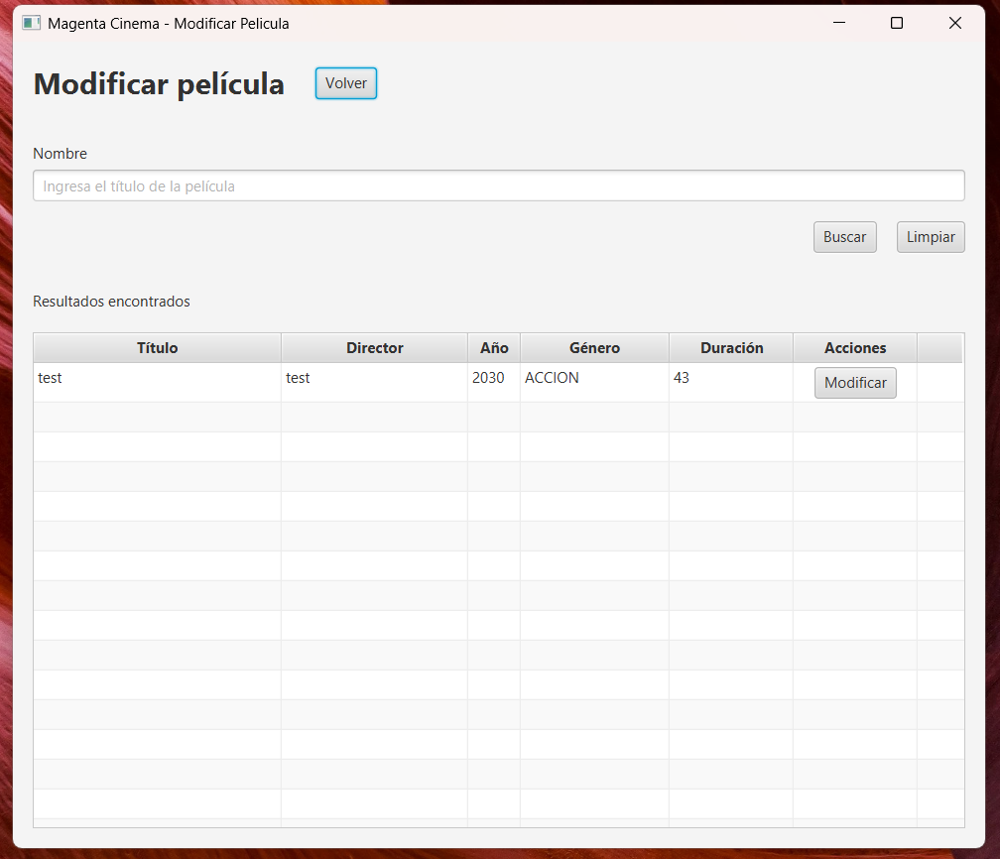
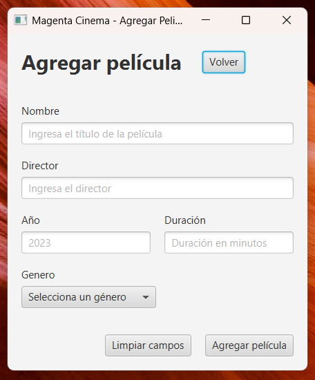

# Magenta Cinema

Para levantar el proyecto en local se debe crear un archivo `.env` en el directorio principal (a nivel del archivo `.env.example`).

Variables a configurar:
- DATABASE_URL
- DATABASE_USERNAME
- DATABASE_PASSWORD

Con esta información se podrá lograr una conexión con la base de datos y poder ejecutar las transacciones.

## Estructura
El archivo con el cual se debe inicializar el aplicativo es `Launcher.java` este vendría a ser el punto de entrada de la
aplicación.

El proyecto está estructurado siguiendo las reglas del patrón de arquitectura **Arquitectura límpia**, presentando las
siguientes capas:
- Core
- Domain
- Application
- Infraestructure
- Presentation

Siguiendo una explicación breve de cada capa, tenemos que la capa core
es la responsable de configuración global de la aplicación, en este caso para la configuración y lectura
de variables de entorno.

La capa de `domain` se establece para manejar las entidades y servicios, es decir mapea generalmente la lógica de negocio
establecida por el proyecto y los requisitos establecidos.

En la capa de `application` es la que mapea los casos de uso o _capacidades_ que tiene la aplicación en el _back-end_,
casos de uso de ejemplo sería agregar películas, eliminarlas, modificarlas, etc.

En la capa de `infraestructure` tenemos la capa que se conecta con servicios externos utilizando interfaces para la conexión
con capas internas (como la de `domain.services`). Aquí se definen los _contratos_ que debe tener el sistema externo,
en este caso se define el _contrato_ que tiene que tener el repositorio de base de datos, para posteriormente lograr una 
implementación correcta con MySQL.

Por último la capa de presentación se realizó con `JavaFx` dejando las vistas dentro de `src.main.resources`, en dicho
directorio se pueden almacenar las vistas con formato `.fxml` compatibles con `JavaFx`.

Cada vista tiene asociado un controlador, que a su vez hace referencia a los casos de uso adaptados anteriormente
para que se puedan trabajar directamente desde el _front-end_ (javafx).

## Core
Como configuraciones adicionales, dentro del directorio principal, se tiene la carpeta SQL que contiene el _DDL_ de la 
base de datos (para que se puedan hacer pruebas en local), en conjunto a ello, dentro del proyecto se hace uso de los 
**procedimientos almacenados** compatibles con MySQL, es por ello que se encuentran los procedimientos que se deben 
instalar en la base de datos MySQL para que el programa pueda leerlos y funcionar correctamente.

# Screenshots

